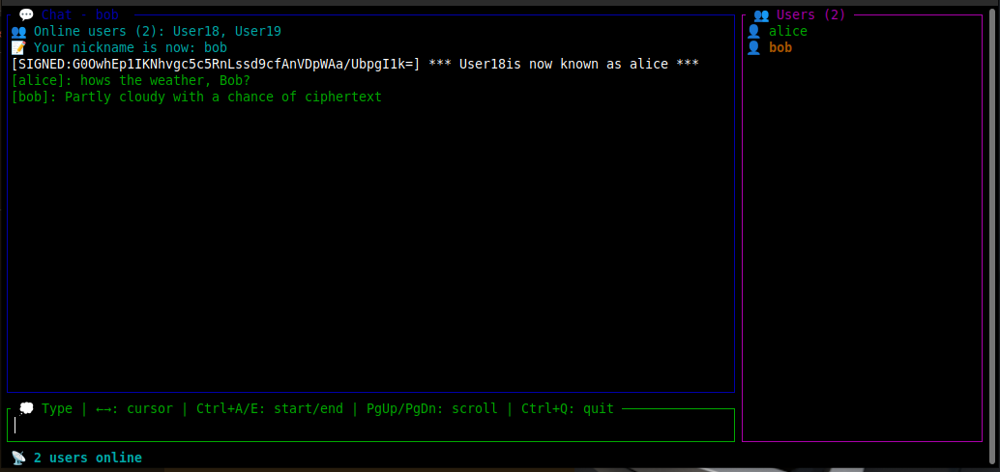

# Crusty 🦀

A secure, real-time chat system built in Rust with TLS encryption, featuring both terminal and TUI interfaces. Server control messages are signed with HMAC.



## Features

- 🔐 **TLS Encryption** - Secure communication using rustls
- 🖥️ **Dual Interface** - Terminal debug mode and colorful TUI
- 👥 **Real-time Chat** - Instant message broadcasting
- 🏷️ **Nickname System** - Change your identity with `/nick`
- 🔒 **Message Authentication** - HMAC-signed control messages
- 📱 **User Roster** - See who's online in real-time
- ⚡ **Non-blocking I/O** - Efficient, responsive communication
- 🎯 **Command System** - Built-in commands for chat management

## Quick Start

### Prerequisites

- Rust 1.70+ and Cargo
- OpenSSL development libraries
- Linux/macOS (Windows support planned)

### Installation

1. **Clone the repository**
   ```bash
   git clone https://github.com/bitstrike/crusty.git
   ```

2. **Generate TLS certificates**
   ```bash
   # Using the Makefile (recommended)
   make certs
   
   # Or manually with the script
   chmod +x gencert.sh
   ./gencert.sh
   ```

3. **Build the project**
   ```bash
   make all
   # or manually:
   cargo build --release
   ```
   
   **Available Makefile targets:**
   - `make all` - Build both server and client
   - `make server` - Build server only
   - `make client` - Build client only
   - `make release` - Build optimized release versions

### Running

1. **Start the server**
   ```bash
   # Debug mode with logging
   cargo run --bin chat -- --debug > server.log 2>&1 &
   
   # Or use the Makefile
   make run-server
   ```

2. **Connect with a client**
   ```bash
   # Terminal debug mode
   cargo run --bin client -- --debug --server localhost:8443 --cert cert.pem
   
   # Fancy TUI interface
   cargo run --bin client -- --tui --server localhost:8443 --cert cert.pem
   
   # Or use the Makefile
   make run-client
   ```
   
   **Additional Makefile run targets:**
   - `make dev-server` - Run server with cargo run (development mode)
   - `make dev-client` - Run client with cargo run (development mode)
   - `make demo` - Run server in background, then client (for testing)

## Usage

### Client Commands

- `/nick <name>` - Change your nickname
- `/who` - List online users
- `/quit` - Exit the chat gracefully

### Client Modes

#### Debug Mode (`--debug`)
- Terminal-based interface for debugging
- Shows detailed connection and message logs
- Ideal for development and troubleshooting

#### TUI Mode (`--tui`)
- Colorful, interactive terminal interface
- Real-time user roster updates
- Chat history with scrolling support
- Status bar with connection information

### Server Features

- **TLS Security**: Encrypted communication on port 8443
- **User Management**: Automatic cleanup of disconnected users
- **Message Broadcasting**: Real-time message delivery
- **Control Messages**: Server-signed system notifications
- **Connection Pooling**: Efficient multi-client handling

## Architecture

### Server (`chat.rs`)
- Multi-threaded client handling
- Channel-based message broadcasting
- HMAC message signing for security
- Automatic user cleanup and timeout handling

### Client (`client.rs`)
- Non-blocking I/O with retry logic
- TLS certificate validation
- Message signature verification
- Dual interface support (debug/TUI)

### Shared Configuration (`config.rs`)
- Centralized constants and message formatting
- HMAC secret key derivation
- Message structure definitions

## Security Features

- **TLS 1.3** encryption for all communications
- **HMAC-SHA256** signatures for control messages
- **Certificate validation** for server authentication
- **Input sanitization** for user messages and nicknames

## Development

### Project Structure
```
chat/
├── Cargo.toml          # Dependencies and build configuration
├── chat.rs             # Server implementation
├── client.rs           # Client implementation
├── config.rs           # Shared configuration and constants
├── gencert.sh          # TLS certificate generation script
├── Makefile            # Build and run commands
└── TODO.md             # Development roadmap
```

### Building
```bash
# Build all binaries
make all

# Build specific components
make server
make client

# Build optimized release versions
make release

# Clean build artifacts
make clean

# Generate TLS certificates
make certs

# Clean only certificates
make clean-certs
```

### Testing
```bash
# Test with OpenSSL client
openssl s_client -connect localhost:8443 -CAfile cert.pem -servername localhost -quiet

# Test with built-in client
cargo run --bin client -- --debug --server localhost:8443 --cert cert.pem

# Run unit tests
cargo test
```

## Configuration

### Server Configuration
- **Port**: 8443 (configurable in code)
- **Max Users**: 100 (configurable)
- **Timeout**: 10 seconds for inactive users
- **TLS**: Uses `key.pem` and `cert.pem`

### Client Configuration
- **Server**: localhost:8443
- **Certificate**: cert.pem for server validation
- **Heartbeat**: 1-3 second randomized intervals
- **Chat History**: 1024 lines with scroll support

## Troubleshooting

### Common Issues

1. **"invalid private key" error**
   - Ensure `gencert.sh` has been run
   - Check file permissions on `key.pem`

2. **Connection refused**
   - Verify server is running on port 8443
   - Check firewall settings

3. **Certificate errors**
   - Ensure `cert.pem` is in the current directory
   - Verify certificate hasn't expired

4. **I/O errors**
   - Client automatically retries with delays
   - Check network connectivity

### Debug Mode
Use `--debug` flag for detailed logging:
```bash
cargo run --bin client -- --debug
cargo run --bin chat -- --debug > server.log 2>&1
```

## Dependencies

### Core Dependencies
- `rustls` - TLS implementation
- `tokio` - Async runtime
- `serde` - Serialization
- `ratatui` - Terminal UI framework
- `crossterm` - Terminal control

### Security Dependencies
- `hmac` - Message authentication
- `sha2` - Cryptographic hashing
- `base64` - Signature encoding

## Contributing

1. Fork the repository
2. Create a feature branch
3. Make your changes
4. Add tests if applicable
5. Submit a pull request

## License

This project is licensed under the GNU General Public License v3.0 - see the [LICENSE](LICENSE) file for details.

**GNU General Public License v3.0**

This program is free software: you can redistribute it and/or modify it under the terms of the GNU General Public License as published by the Free Software Foundation, either version 3 of the License, or (at your option) any later version.

This program is distributed in the hope that it will be useful, but WITHOUT ANY WARRANTY; without even the implied warranty of MERCHANTABILITY or FITNESS FOR A PARTICULAR PURPOSE. See the GNU General Public License for more details.

You should have received a copy of the GNU General Public License along with this program. If not, see [https://www.gnu.org/licenses/](https://www.gnu.org/licenses/).

## Acknowledgments

- Built with Rust for performance and safety
- Inspired by modern chat applications
- Uses industry-standard TLS and cryptographic primitives

---

**Crusty** - Secure chat, built with Rust! 🦀✨
